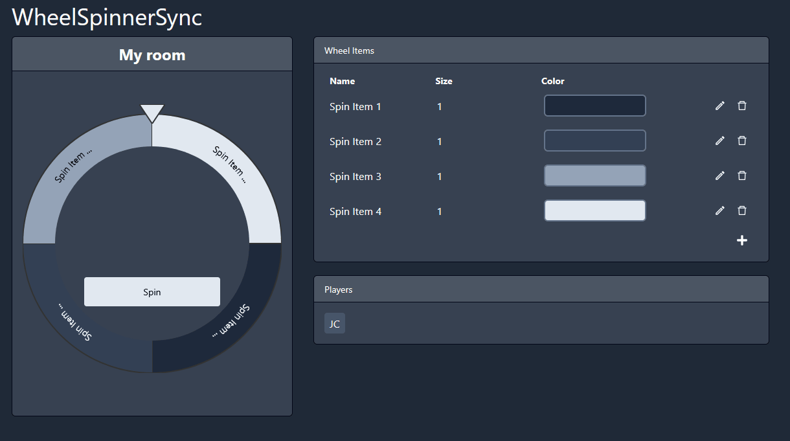
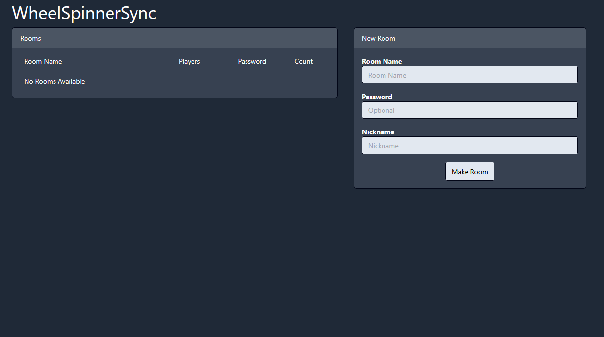
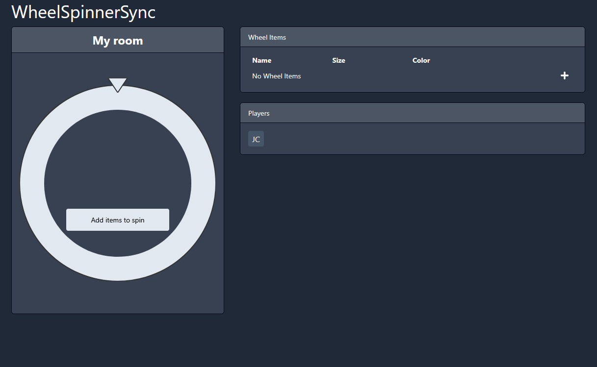
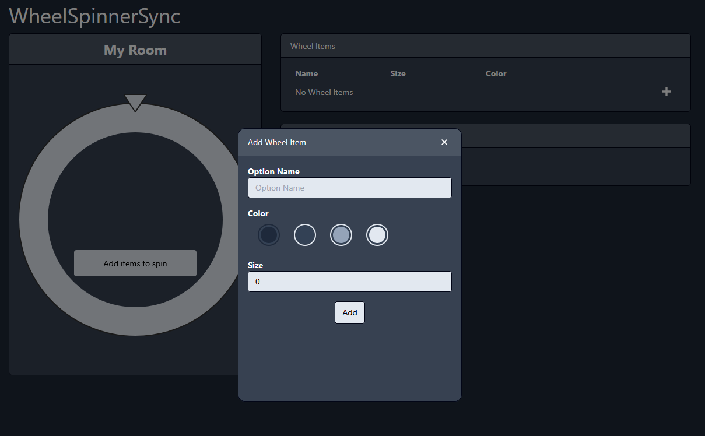
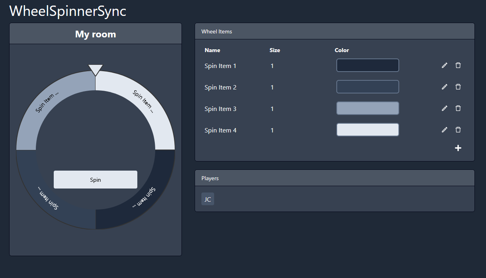

# Wheel Spinner Sync

Wheel Spinner Sync is a web application that allows users to edit a wheel of choices together and syncs the spins between the users.

Live Demo here: [Wheel Spinner Sync](https://jc8299.github.io/wheelspinnersync/)

<p align="center">
  
</p>

The idea was inspired by [BingoSync](http://bingosync.com/) and was meant to be a fun project that I could use with my friends.

This project uses:

- React
- Typescript
- TailwindCSS
- React Icons
- Google Firebase

## Features

- Public and private rooms
- Collaboratively add, edit, and delete wheel items
- Syncs spins and wheel rotation

## Usage/Examples

Homepage where users will either join existing rooms or create their own room

<p align="center">
  
</p>

Initial room when created

<p align="center">
  
</p>

Modal when adding, editing, or deleting items

<p align="center">
  
</p>

Room with added items

<p align="center">
  
</p>

## Environment Variables

To run this project, you will need to add the following environment variables to your .env file

`REACT_APP_FIREBASE_API_KEY`

## Run Locally

You will need your own Firebase API key and account.

Clone the project

```bash
  git clone https://github.com/jc8299/wheelspinnersync
```

Go to the project directory

```bash
  cd my-project
```

Install dependencies

```bash
  npm install
```

Start the server

```bash
  npm run start
```

Open `http://localhost:3000` in your web browser

## License

[MIT](https://choosealicense.com/licenses/mit/)
